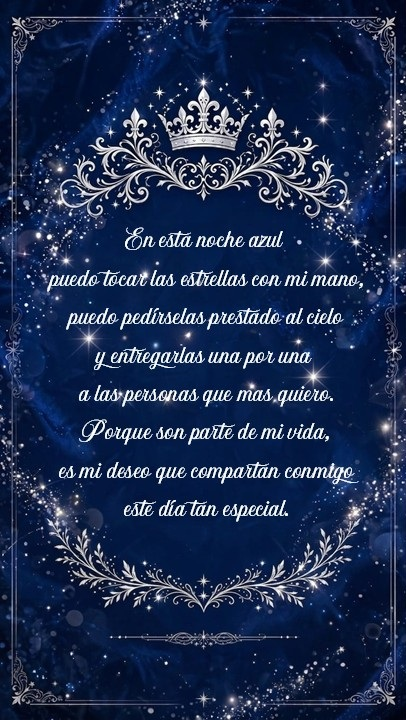
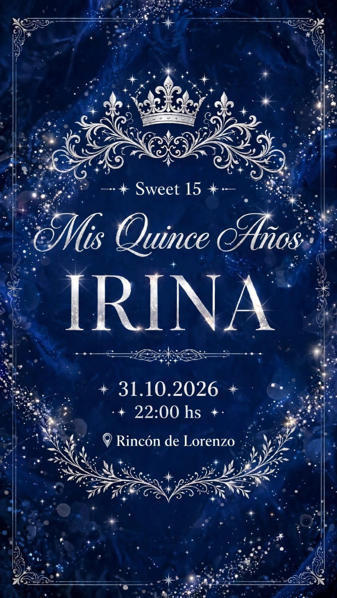
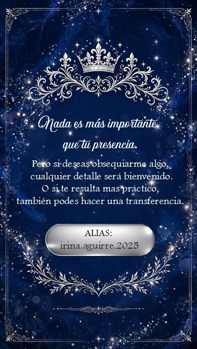

<!DOCTYPE html>
<html lang="es">
<head>
  <meta charset="UTF-8" />
  <meta name="viewport" content="width=device-width, initial-scale=1.0, maximum-scale=1.0, user-scalable=no" />
  <title>Mis Quince Años - IRINA</title>
  
</head>
<body>

  <!-- Audio de fondo (con loop para que se repita) -->
  <audio id="background-audio" loop>
    <source src="Moonstruck.mp3" type="audio/mp3">
  </audio>

  <!-- Botón flotante para controlar la música manualmente -->
  <button class="music-btn" id="music-toggle" onclick="toggleMusic()" title="Reproducir / Pausar música">
    🎵
  </button>

  

    <!-- Imagen 1 carga de inmediato -->
    
    
    <!-- Imágenes 2 y 3 con lazy loading para optimizar velocidad -->
    
    
    
    <!-- Botón interactivo para ver la ubicación en Google Maps -->
    

      <a href="https://www.google.com/maps/place/Rincon+De+Lorenzo/@-27.505876,-58.833958,19z/data=!4m6!3m5!1s0x94456c77ae2749b7:0xa639e7a19a33dfac!8m2!3d-27.5058764!4d-58.8339577!16s%2Fg%2F11f0l3f4ql?hl=es&entry=ttu&g_ep=EgoyMDI2MDkwMi4wIKXMDSoASAFQAw%3D%3D" target="_blank" class="btn-ubicacion">
        📍 VER UBICACIÓN
      </a>
    

  

  <!-- Script para la música -->
  

</body>
</html>
